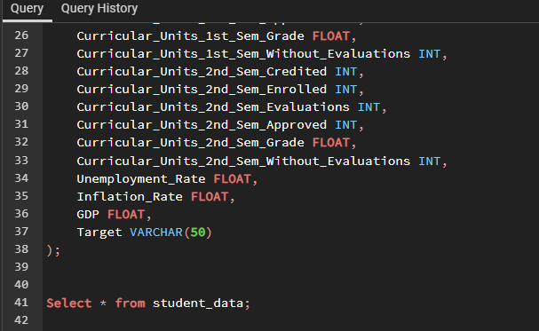
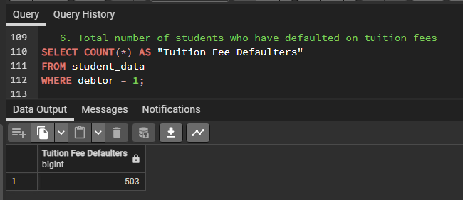

# Empowering-Student-Success-A-Deep-Dive-into-Graduation-Data
Welcome to "Empowering Student Success," your data-driven portal into higher education. The repository offers a nice perspective on academic success, persistence, and the challenges faced by students on their educational journey.

## Introduction
Education is a journey, and we believe that understanding all aspects of this journey is vital for academic institutions, educators, policymakers, and students themselves. "Student Success" offers a variety of analyses and visualizations aimed at uncovering the secrets to student success, persistence, and the challenges they face. Education is the cornerstone of society, and understanding the dynamics that influence student success is paramount. This repository offers a comprehensive exploration of graduation patterns, dropout trends, and factors shaping students' academic journeys.

## Problem Statement
In today's educational landscape, institutions face significant challenges related to student retention, dropout rates, and program effectiveness. It's crucial to identify the underlying causes of these issues and work toward data-driven solutions. This project addresses these challenges by conducting comprehensive data analysis and deriving actionable insights from student graduation data.  
In order to solve these problems, I had to find answers to the following questions.
1. How many students have successfully graduated?
2. What is the average age of students at enrollment?
3. How many students are scholarship holders?
4. How many students have an international background?
5. How many students have educational special needs?
6. What is the total number of students who have defaulted on tuition fees?
7. How many students have been displaced ?
8. What is the gender distribution among students?
9. What is the current status of Students?
10. What is top 5 courses for students at school?
11. What is the marital status distribution among students?

## Project Objective
 The aim is to examine the graduation trends and factors contributing to student success, understand Dropout Patterns, explore how long students typically remain enrolled and the factors influencing their decisions, Analyze the role of scholarships and implications of tuition fee defaults, assess the impact of age, special needs, and international status of students, understand gender distribution among students.  The task is to leverage SQL to explore and analyze the dataset, extracting valuable insights to aid in understanding the school's students data better.  
 **Dataset** I was provided with 3 different dataset. The datasets are attached to the repository
 The Graduation dataset
 Course dataset
 Marital Status dataset.

## Data Analysis
As we explore students' data, we will conduct extensive data analysis, visualization, and interpretation. I will use SQL queries to manipulate the data, Power BI for creating interactive visualizations, and provide detailed explanations.  
The first step was to create the tables in the database

1. How many students have successfully graduated?  
This query counts the number of students who have successfully graduated by filtering records where the "Target" column equals 'Graduate.'  
The result provides the total count of graduates in the dataset.  
The school produced 2209 graduates.

2. What is the average age of students at enrollment?
This query calculates the average age of students when they enrolled by selecting the "Age at enrollment" column and applying the AVG() function.  
The result represents the average age of students when they started their courses.  
The average age at enrollment for students is 23 years.

3. How many students are scholarship holders?
This query counts the students who are scholarship holders, as indicated by the value 1 in the "Scholarship holder" column.  
The result shows the total count of students who have scholarships.  
We have a total of 1099 students who have scholarship.

4. How many students have an international background?
This query counts the students with an international background, where the "International" column equals 1.  
The result provides the total count of international students.  
The school has a total of 110 international students.

5. How many students have educational special needs?
This query counts the students who have educational special needs, as indicated by the value 1 in the "Educational special needs" column.  
The result shows the total count of students with special needs.  
We have 51 students who have special needs in the school.

6. What is the total number of students who have defaulted on tuition fees?
This query counts the students who have defaulted on tuition fees, where the "Debtor" column equals 1.  
The result provides the total count of students who have not paid their tuition fees.  
503 students have failed or defaulted on their school fees.

7. How many students have been displaced ?
This query counts the students who have been displaced, as indicated by the value 1 in the "Displaced" column.  
The result provides the total count of students who have experienced displacement.  
2426 students attending the school have been displaced which is quite high considering we have 4424 students.

8. What is the gender distribution among students?
This query helps in understanding the gender composition of students in the dataset. You can see how many students are male and how many are female.  
It's valuable for assessing gender diversity in your dataset.  
We have 2868 Female students and 1556 Male students

10. What is the current status of Students?
This query helps in assessing the current status of students in the dataset. You can see how many students fall into each status category.  
It's useful for monitoring student progress and identifying trends in graduation rates and dropouts.  
We have 2209 students who have graduated, 1421 students who have dropped out and 794 students who are still enrolled at the school

11. What is top 5 courses for students at school?
This query identifies the most popular courses among students. You can see which courses have the highest enrollment counts.  
It's valuable for academic institutions to understand course demand and allocate resources accordingly.  
Engineering, Economics, English, Political Science and Mathematics are most taken courses among students at the school.

12. What is the marital status distribution among students?
This query helps in understanding the marital status diversity among students. You can see how many students are married, single, divorced, etc.  
It can be useful for tailoring services or support programs to different marital status groups.  
We have 3919 students who identify as Single.  
379 students who are married.  
91 students who are divorced.  
25 students who are seperated.  
6 students who are in a registered partnership.  
3 students who are widowed.  

Here are the Key Performance Indicators (KPIs) that provide better solutions and answers to our problem statements. These KPIs can be tracked and should be tracked as they provide better analysis for the educational performance, institutional effectiveness, student scuccess.
1. Graduation Rate: Number of Graduates
2. Dropout Rate: Number of students who dropped out.
3. Scholarship: Number of students who are on scholarship.
4. Average Age at Enrollment: Age at whihc most of the students get enrolled at the school.
5. Displaced Student: Number of students who are displaced for one reason or the other.
6. International Student: Number of Students who are enrolled at the school who are international students
7. Special Needs: Number of students who have special needs.

## Visualization
To better understand the findings, I made use of Power BI to create a visual which would be interactive and easy to understand as well.

![](
   
## Recommedations
Here are some superb and excellent recommendations  

Scholarship Programs: Given that a significant number of students are scholarship holders, it is advisable for schools to continue offering scholarship programs. Additionally, schools can explore expanding these programs to attract more students.  

Support for Special Needs: Schools should prioritize providing support and resources for students with educational special needs. This can include specialized tutoring, accessible facilities, and assistive technologies to ensure that all students have equal opportunities for success.

Tuition Fee Management: Schools should implement effective tuition fee management systems to reduce the number of tuition fee defaulters. This could involve better communication about payment deadlines, flexible payment plans, and financial counseling services.

International Student Engagement: Institutions should continue to promote diversity and inclusivity to attract and support international students. Specialized programs, language support, and cultural integration initiatives can enhance the experience of international students.

Early Intervention for Dropouts: To reduce the number of dropouts, schools should implement early intervention strategies. Academic advisors and counselors can identify struggling students and provide them with necessary support and guidance.

## Conclusion
The value of education goes beyond numbers; it is a matter of lives, opportunities, and futures. Educators, institutions, and policymakers can make informed decisions and create an environment where all students can flourish when we discover the stories hidden within this dataset.  
The dataset reflects a diverse student population with various backgrounds and needs, including international students, scholarship holders, and those with special educational needs.
The presence of tuition fee defaulters highlights the importance of effective financial management in school.  
While the dataset provides insights into educational outcomes, further analysis may be needed to understand the specific factors contributing to student success or dropout.
The number of dropouts indicates that some students may face challenges in completing their courses. Identifying and addressing these challenges early can help improve retention rates.  
The dataset underscores the need for schools to adapt and cater to the diverse needs of their student body to ensure equitable educational opportunities for all.
